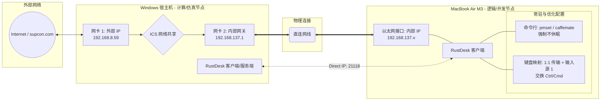

# Mac 与 window 共享一套键鼠

## 整体架构

### **HOS 混合算力开发架构**

1. **网络拓扑 (ICS 共享)**：Windows 宿主机利用双网卡开启 **ICS (Internet 连接共享)**，通过物理网线与 Mac 直连，构建出 `192.168.137.x` 的独立高速私有子网。
2. **控制链路 (P2P 直连)**：采用 **RustDesk IP 直连模式**，基于内部 IP 实现点对点（Port 21118）通信，跳过公网中继，保障极低延迟的画面推流。
3. **系统常驻 (服务器化)**：Mac 端通过命令行工具（`pmset`）**禁用系统休眠**，实现合盖状态下逻辑控制服务的 7×24 小时持续在线。
4. **交互逻辑 (物理映射)**：配置 RustDesk **“1:1 传输 + 输入源 1”** 方案并交换 Ctrl/Cmd 键，将 Windows 键盘设为物理码透传，由 Mac 本地处理原生中文输入。

**架构定义**：一套基于物理直连，实现 **Windows 仿真算力**与 **Mac 逻辑开发**解耦并行的生产力闭环环境。

## 操作步骤

### **一、 核心配置步骤**

1. **网络层：Windows 开启网卡共享 (ICS)**
   - **操作**：在 Windows “网络连接”中，右键连接外网的网卡 -> 属性 -> 共享 -> 勾选“允许其他网络用户通过此计算机的 Internet 连接来连接”。
   - **结果**：直连 Mac 的网卡 IP 会被强制固定为 `192.168.137.1`。
2. **通信层：RustDesk 开启 IP 直连**
   - **操作**：Mac 端 RustDesk -> 设置 -> 安全 -> 勾选“允许 IP 直接访问” -> 确认端口为 `21118`。
   - **连接**：Windows 端输入 `192.168.137.x:21118`（x 为 Mac 实际 IP）直接控制。
3. **常驻层：Mac 禁用合盖休眠**
   - **指令**：终端执行 `sudo pmset -a disablesleep 1`。
   - **注意**：必须连接电源适配器，否则合盖仍可能触发系统节能保护。
4. **交互层：键盘映射对齐**
   - **配置**：RustDesk 顶部菜单选择 **“1:1 传输”** + **“输入源 1”**。
   - **键位**：勾选“交换 Control 键和 Command 键”，使 Windows 键盘适配 Mac 操作习惯。

### **二、 常见问题与快速解决方案**

| **模块**       | **故障现象**                                                 | **快速解决方案**                                             |
| -------------- | ------------------------------------------------------------ | ------------------------------------------------------------ |
| **网络**       | Mac 获取不到 IP 或 IP 变为 `169.254.x.x`                     | 在 Windows 上**重新开关一次**网卡共享功能（先取消再勾选），强制重置网关。 |
| 恢复系统的休眠 | 你在公司为了远程办公设置了 `disablesleep 1`，下班前**必须**将其改回默认状态，否则合盖后 CPU 依然会高频运行。 | sudo pmset -a disablesleep 0                                 |